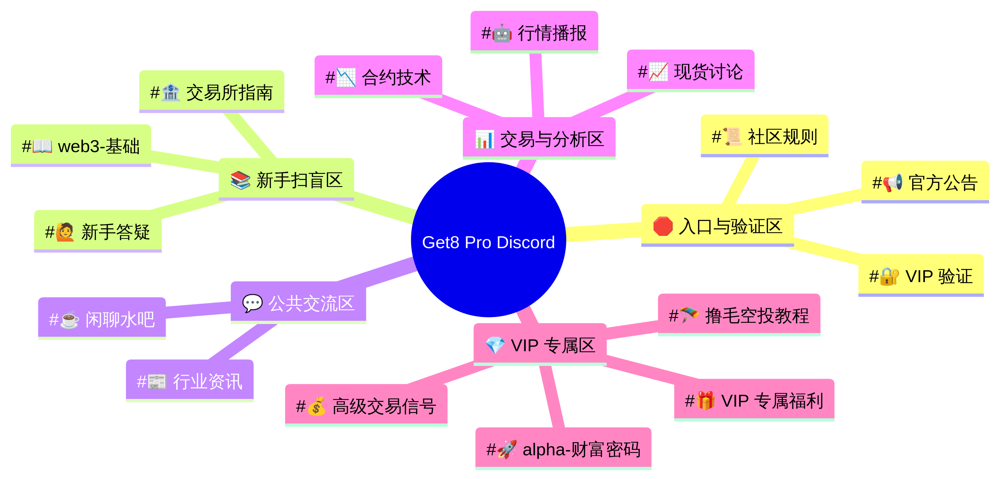

# Get8 Pro Discord 社群频道架构与管理方案

> **品牌定位**：Get8, Get Pro. 臻于至善。
> **适用对象**：单人管理员，面向 Web3 交易者与币圈新手
> **文档版本**：v1.0 · 2026-03-13

---

## 一、核心设计理念

本方案围绕 Get8 Pro 的三大业务板块展开设计：**Web3 入圈扫盲**、**交易所返佣与省钱指南**、**专业交易分析与 Alpha 撸毛**。整体架构遵循"入口严格、内容分层、权益差异化"的原则——公开区域吸引流量，VIP 专属区沉淀核心用户，机器人承担日常运营工作，让一个人也能高效管理整个社群。

---

## 二、角色与权限体系

权限体系是社群的基石。清晰的角色分层不仅能保护高价值内容，还能激励用户完成邀请码注册以解锁更多权益。

| 角色 | 颜色 | 核心权限 | 获取方式 |
| :--- | :--- | :--- | :--- |
| **👑 创始人 Admin** | 红色 `#FF4444` | 服务器最高权限，管理所有频道、角色、机器人 | 手动分配（仅你自己） |
| **🛡️ 巡管 Mod** | 橙色 `#FF8C00` | 禁言、踢人、删消息、置顶消息 | 手动分配（信任的助手） |
| **💎 Get8 VIP** | 金色 `#FFD700` | 解锁全部 VIP 专属频道，享受 Alpha 信号、撸毛教程、专属福利 | 通过 Get8 Pro 邀请码注册交易所后，机器人验证 UID 自动分配 |
| **📈 Pro 交易员** | 蓝色 `#4169E1` | 访问进阶交易分析频道，参与高质量讨论 | 社区活跃度达到一定等级后由 MEE6/Carl-bot 自动升级 |
| **🌱 Web3 新手** | 绿色 `#32CD32` | 访问公共交流区、新手扫盲区、基础行情频道 | 在规则频道点击表情反应后由机器人自动分配 |
| **👻 未认证用户** | 灰色（默认） | 仅可见验证频道和规则频道，其他频道全部隐藏 | 加入服务器后的默认状态 |

**权限流转逻辑**：新用户加入 → 仅见入口区 → 同意规则获得"Web3 新手"角色 → 可见公共区 → 通过邀请码验证获得"Get8 VIP"角色 → 解锁全部专属内容。

---

## 三、频道结构详细设计

以下是完整的频道分组（Category）与频道（Channel）设计，共 5 个分组、15 个频道。

### 🛑 分组一：入口与验证区 (Entry & Verification)

**可见权限**：所有人（包括未认证用户）

此区域是新成员加入服务器后唯一能看到的区域，承担过滤、引导和验证三大功能。

| 频道名称 | 类型 | 说明 | 可发言角色 |
| :--- | :--- | :--- | :--- |
| `#📜 社区规则 rules` | 文字 | 展示社群守则、免责声明、内容分类说明。底部设置 Carl-bot Reaction Role，用户点击 ✅ 表情自动获得"Web3 新手"角色。 | 仅 Admin |
| `#🔐 VIP 验证 vip-verify` | 文字 | 说明如何通过 Get8 Pro 专属邀请码注册交易所，并提供 UID 提交入口。机器人验证后自动赋予 VIP 角色。 | 所有人（提交 UID） |
| `#📢 官方公告 announcements` | 文字 | 发布重要通知、活动信息、系统更新。开启"慢速模式"防止刷屏。 | 仅 Admin/Mod |

---

### 📚 分组二：新手扫盲区 (Web3 Onboarding)

**可见权限**：Web3 新手及以上角色

落实"懂其然，更知其所以然"的品牌精神，帮助新用户系统建立 Web3 知识体系。

| 频道名称 | 类型 | 说明 | 可发言角色 |
| :--- | :--- | :--- | :--- |
| `#📖 web3基础 web3-basics` | 文字 | 区块链基础、钱包创建（MetaMask/OKX Wallet）、DeFi 概念、NFT 扫盲等教程帖子。 | 仅 Admin（帖子区） |
| `#🏦 交易所指南 exchange-guide` | 文字 | Binance、OKX、Bybit 等主流交易所的注册、充值、提现、KYC、现货/合约开通等操作图文教程。 | 仅 Admin（帖子区） |
| `#🙋 新手答疑 qa-help` | 文字 | 新手提问专区，老玩家和管理员协助解答，机器人可设置常见问题自动回复。 | 所有认证用户 |

---

### 💬 分组三：公共交流区 (General Discussions)

**可见权限**：Web3 新手及以上角色

日常社区互动和行业资讯聚合，维持社群活跃度。

| 频道名称 | 类型 | 说明 | 可发言角色 |
| :--- | :--- | :--- | :--- |
| `#☕ 闲聊水吧 general-chat` | 文字 | 日常吹水、非交易相关话题，维持社区温度。 | 所有认证用户 |
| `#📰 行业资讯 crypto-news` | 文字 | 通过 MoniBot 或 RSS 机器人自动抓取 CoinDesk、The Block 等媒体的最新资讯。 | 机器人推送 + Admin |
| `#🎙️ 语音大厅 voice-lounge` | 语音 | 用于不定期的语音分享、AMA（Ask Me Anything）活动。 | 所有认证用户 |

---

### 📊 分组四：交易与分析区 (Trading & Analysis)

**可见权限**：Web3 新手及以上角色（部分高级内容限 Pro 交易员）

专注于市场行情分析和交易策略探讨，体现"像专业人士一样交易"的品牌主张。

| 频道名称 | 类型 | 说明 | 可发言角色 |
| :--- | :--- | :--- | :--- |
| `#📈 现货讨论 spot-trading` | 文字 | BTC/ETH 等主流币及山寨币的现货投资机会、基本面分析、持仓讨论。 | 所有认证用户 |
| `#📉 合约技术 futures-tech` | 文字 | K 线分析、技术指标（RSI/MACD/布林带）探讨、合约交易策略分享。建议限制 Pro 交易员及以上发言，避免低质量噪音。 | Pro 交易员及以上 |
| `#🤖 行情播报 market-alerts` | 文字 | Alpha.bot 或 Coingecko 机器人自动推送大额转账预警、价格异动、Fear & Greed 指数等数据。 | 机器人推送 |

---

### 💎 分组五：VIP 专属区 (Get8 VIP Exclusive)

**可见权限**：仅限 Get8 VIP 角色（此分组对其他所有角色完全隐藏）

这是整个社群的核心价值区域，也是用户通过邀请码注册的最大驱动力。

| 频道名称 | 类型 | 说明 | 可发言角色 |
| :--- | :--- | :--- | :--- |
| `#🚀 alpha财富密码 alpha-calls` | 文字 | 早期项目发现、高潜力代币推荐、链上数据异动解读。 | 仅 Admin/Mod |
| `#🪂 撸毛空投教程 airdrop-guides` | 文字 | 详细的交互教程（含截图步骤）、测试网参与指南、防女巫策略、空投项目追踪表。 | 仅 Admin/Mod |
| `#💰 高级交易信号 pro-signals` | 文字 | 经过筛选的短线/波段交易参考信号，附带止损止盈建议。 | 仅 Admin/Mod |
| `#🎁 VIP专属福利 vip-rewards` | 文字 | VIP 专属抽奖、周边发放、线下活动通知、返佣收益报告。 | 仅 Admin/Mod |

---

## 四、机器人配置方案

以下是推荐的机器人组合，覆盖从入门管理到专业功能的全部需求，且均为免费或低成本方案。

### Bot 1：Carl-bot（核心管理机器人）

Carl-bot 是目前最主流的 Discord 社群管理机器人之一，提供 Reaction Roles、Auto-Mod、日志记录等功能，是一人管理大型服务器的必备工具。

**关键配置步骤**：

1. 前往 [carl.gg](https://carl.gg) 邀请机器人并登录仪表盘。
2. **Reaction Roles（反应角色）**：在 `#📜 社区规则` 频道底部发送一条消息，通过 Carl-bot 仪表盘将 ✅ 表情与"Web3 新手"角色绑定。用户点击表情即自动获得角色。
3. **Auto-Mod（自动审核）**：启用以下过滤规则：
   - 过滤包含 `http://` 等非白名单链接（防止钓鱼链接）
   - 过滤关键词：`私钥`、`助记词`、`seed phrase`（防止诈骗）
   - 对新加入用户（账号注册不足 7 天）的消息进行额外审查
4. **Logging（日志记录）**：创建一个仅管理员可见的 `#🔒 mod-log` 频道，记录所有消息删除、用户封禁、角色变更等操作。

---

### Bot 2：Invite Tracker（邀请追踪机器人）

Invite Tracker 专门用于追踪哪个邀请链接带来了哪些新用户，是实现 VIP 邀请码体系的基础工具。

**关键配置步骤**：

1. 前往 [invite-tracker.com](https://invite-tracker.com) 邀请机器人。
2. 为 Get8 Pro 的专属邀请码创建独立的 Discord 邀请链接，通过 Invite Tracker 仪表盘将该链接与"Get8 VIP"角色绑定。
3. 设置：通过该专属邀请链接加入的用户，在完成 UID 验证后（见 Bot 3 说明），由机器人自动赋予 VIP 角色。
4. 可在管理员专属频道中查看每日新增 VIP 用户报告。

> **进阶方案**：若需要严格验证用户是否通过 Get8 Pro 邀请码在交易所完成注册（即核查返佣关系），建议开发一个简单的定制 Discord 机器人，通过交易所开放 API（如 Binance Broker API）核验用户 UID 是否在返佣名下，验证通过后自动赋予 VIP 角色。这是最安全可靠的验证方式。

---

### Bot 3：Alpha.bot（行情数据机器人）

Alpha.bot 是 Discord 上最主流的金融数据机器人，支持加密货币、股票、外汇的实时图表和价格查询。

**关键配置步骤**：

1. 前往 [alpha.bot](https://www.alpha.bot) 邀请机器人。
2. 在 `#🤖 行情播报` 频道设置 BTC、ETH 等主流币的价格警报（如跌破/突破某价格时自动推送）。
3. 允许用户在交易讨论频道使用斜杠命令（如 `/chart BTC 1D`）快速调出日线 K 线图。

---

### Bot 4：MEE6（等级与活跃度系统）

MEE6 提供用户活跃度等级系统，可以将"Pro 交易员"角色与活跃度等级挂钩，激励用户持续参与社区讨论。

**关键配置步骤**：

1. 前往 [mee6.xyz](https://mee6.xyz) 邀请机器人并配置等级系统。
2. 设置当用户达到特定等级（如 Level 10）时，自动赋予"Pro 交易员"角色。
3. 配置欢迎消息：新用户加入时，在 `#☕ 闲聊水吧` 发送个性化欢迎语，引导其前往规则频道完成认证。

---

## 五、管理员日常操作 SOP

以下是建议的日常管理标准操作流程（Standard Operating Procedure），帮助你以最小精力维持社群高质量运转。

| 频率 | 任务 | 操作说明 |
| :--- | :--- | :--- |
| **每日** | 检查 VIP 验证申请 | 查看 `#🔐 VIP 验证` 频道，处理待验证的用户 UID，或检查机器人自动处理结果。 |
| **每日** | 发布 Alpha/空投内容 | 在 VIP 专属区更新最新的 Alpha 信息和撸毛教程。 |
| **每日** | 检查 Mod 日志 | 查看 `#🔒 mod-log`，确认 Auto-Mod 是否有误判，处理异常情况。 |
| **每周** | 发布行情分析 | 在 `#📈 现货讨论` 或 `#📉 合约技术` 发布周度市场复盘和展望。 |
| **每周** | 更新教程内容 | 在新手扫盲区补充或更新交易所操作指南（如交易所有功能更新）。 |
| **每月** | 发布返佣收益报告 | 在 `#🎁 VIP专属福利` 公布当月返佣数据，增强用户信任感。 |
| **不定期** | 举办 AMA 或抽奖 | 利用语音大厅举办 AMA，或通过 Carl-bot 的 Giveaway 功能举办抽奖活动，提升社区活跃度。 |

---

## 六、频道结构可视化

---

## 七、快速搭建清单

按以下顺序搭建，可在 2-3 小时内完成基础架构：

1. **创建 Discord 服务器**，命名为 `Get8 Pro`，上传品牌 Logo 作为服务器图标。
2. **创建所有角色**，按上文设置颜色和权限（注意：角色列表中越靠上，权限越高）。
3. **创建 5 个分组和 15 个频道**，为每个分组和频道设置正确的角色可见权限。
4. **邀请 Carl-bot**，配置 Reaction Roles 和 Auto-Mod 规则。
5. **邀请 Invite Tracker**，创建专属邀请链接并绑定 VIP 角色。
6. **邀请 Alpha.bot**，在行情播报频道配置价格警报。
7. **邀请 MEE6**，配置欢迎消息和等级系统。
8. **填充内容**：在新手扫盲区发布第一批教程，在 VIP 区发布第一批 Alpha 信息。
9. **测试全流程**：用小号模拟新用户加入，验证权限流转是否正常。

---

*本方案由 Manus AI 根据 Get8 Pro 品牌定位与业务需求定制设计。*
